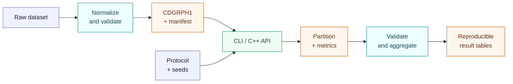

<div align="center">

<p><strong>English</strong> · <a href="README.vi.md">Tiếng Việt</a></p>

# Community Detection Benchmark

<p><strong>A C++17/Python pipeline for verifiable and reproducible community-detection experiments</strong></p>

Implement, run, and evaluate **Girvan–Newman**, **Spectral Clustering**,
**Louvain**, and **Label Propagation** under one consistent protocol.

<p>
  <a href="https://github.com/DongQuanz/community_detection_cpp/actions/workflows/ci.yml"></a>
  <a href="https://isocpp.org/"></a>
  <a href="https://www.python.org/"></a>
  <a href="https://cmake.org/"></a>
</p>

<p>
  <a href="LICENSE"></a>
  
  
</p>

[Overview](#overview) · [Algorithms](#algorithms) · [Quick start](#quick-start) · [Experiments](#running-experiments) · [Metrics](#metric-suite) · [Structure](#repository-structure) · [Citation](#citation)

</div>

---

## Overview

**Community Detection Benchmark** combines a high-performance C++17 core with
Python orchestration tools. It places four community-detection algorithms behind
the same data format, API, CLI, and evaluation protocol so their results can be
compared fairly and reproduced reliably.

| | At a glance |
|---|---|
| **Methods** | Girvan–Newman · Spectral RatioCut/Ncut · Louvain · LPA |
| **Canonical input** | A simple, undirected, unweighted graph after preprocessing |
| **Compute core** | C++17, CSR storage, no required third-party C++ dependency |
| **Orchestration** | Python for dataset preparation, job scheduling, provenance, and aggregation |
| **Evaluation** | Intrinsic quality, external agreement, stability, robustness, and resources |
| **Target datasets** | Karate · Football · ca-CondMat · GraphSAINT/Reddit2 |

### Highlights

- **One consistent interface** for all four algorithms through a C++ library and CLI.
- **End-to-end reproducibility** through seeds, checksums, configs, manifests, and binary hashes.
- **No silent failures:** every infeasible job retains an explicit status and reason.
- **Multi-dimensional evaluation:** partition quality is reported with reliability and cost.
- **Strict scope separation:** full graphs, 400-node samples, and 5,000-node samples are never pooled.
- **Data-safe repository:** datasets, experimental output, caches, and secrets stay outside Git.

### Pipeline architecture



> [!IMPORTANT]
> Every algorithm returns a disjoint partition whose community labels are
> normalized to `0..K-1`.

## Algorithms

| Method | Implementation | Intended scale |
|---|---|---|
| **Girvan–Newman** | Unweighted Brandes; remove exactly one maximum-betweenness edge and recompute after every step | Small graphs and registered samples |
| **Spectral** | RatioCut/Ncut; dense Jacobi and matrix-free Lanczos backends; mandatory residual checks | Small to medium graphs, subject to resource guards |
| **Louvain** | Multi-level modularity optimization with the same `resolution` at every level | Large graphs |
| **Label Propagation** | Seeded synchronous or asynchronous updates with isolates preserved | Large graphs |

<details>
<summary><strong>Key implementation guarantees</strong></summary>

- Girvan–Newman recomputes Brandes after **every** removed edge.
- Spectral Ncut with `K=2` uses the correct coordinate `g = D^{-1/2}z`.
- The large spectral backend never constructs an `n × n` matrix and rejects inaccurate eigenpairs.
- Louvain uses one consistent `resolution` in local moves, aggregation, objectives, and metrics.
- Every stochastic decision in LPA depends exclusively on the configured seed.

</details>

## Requirements

| Component | Version |
|---|---:|
| C++ compiler | C++17 support |
| CMake | 3.18 or newer |
| Python | 3.10 or newer |
| Python packages | See [`requirements.txt`](requirements.txt) |

## Quick start

### 1. Build and test

```bash
cmake -S . -B build -DCMAKE_BUILD_TYPE=Release
cmake --build build --config Release --parallel
ctest --test-dir build -C Release --output-on-failure
```

> [!NOTE]
> Single-configuration generators on Linux and macOS ignore `-C Release`.
> Visual Studio commonly places executables under `build/Release/`.

### 2. Prepare the Python environment

<details open>
<summary><strong>Linux / macOS</strong></summary>

```bash
python3 -m venv .venv
source .venv/bin/activate
python -m pip install --upgrade pip
python -m pip install -r requirements.txt
```

</details>

<details>
<summary><strong>Windows PowerShell</strong></summary>

```powershell
python -m venv .venv
.venv\Scripts\Activate.ps1
python -m pip install --upgrade pip
python -m pip install -r requirements.txt
```

</details>

### 3. Run the minimal example

```bash
./build/run_toy_example
```

With a Visual Studio multi-configuration build, run
`build/Release/run_toy_example.exe` instead.

```cpp
#include <community_detection/community_detection.hpp>

cd::Graph graph(3);
graph.add_edge(0, 1);
graph.add_edge(1, 2);

cd::louvain::Config config;
config.seed = 42;

const auto result = cd::experiment::run(graph, config);
```

## Running experiments

### Step 1 — Prepare datasets

Download the datasets according to [`data/README.md`](data/README.md), then run:

```bash
python tools/prepare_datasets.py \
  --config configs/datasets.example.json
```

The preparation tool removes self-loops and duplicate edges, maps node IDs to
`0..n-1`, creates the registered induced samples, and records SHA-256 checksums
in `data/processed/manifest.json`.

### Step 2 — Preview the job matrix

```bash
python tools/run_experiments.py \
  --config configs/experiments.json \
  --binary build/community_detect \
  --dry-run
```

For Visual Studio multi-configuration builds, use
`build/Release/community_detect.exe` as the binary path.

### Step 3 — Run or resume safely

```bash
python tools/run_experiments.py \
  --config configs/experiments.json \
  --binary build/community_detect \
  --resume
```

### Step 4 — Validate and aggregate

```bash
python tools/summarize_results.py \
  --results results \
  --manifest data/processed/manifest.json
```

> [!CAUTION]
> Jobs run sequentially by default so resource contention does not distort
> runtime and peak-memory measurements. A skipped job is never recorded as `0`:
> the runner emits `skipped_resource_guard` with a concrete reason.

### Run one algorithm

```bash
build/community_detect \
  --graph data/processed/karate/full.cdgraph \
  --reference data/processed/karate/reference.tsv \
  --dataset karate \
  --algorithm louvain \
  --seed 42 \
  --resolution 1.0 \
  --output-dir results/manual/karate_louvain_seed42
```

Run `community_detect --help` for the complete option reference. Every run
writes a normalized partition, per-community metrics, a machine-readable
summary, convergence diagnostics, and execution timings.

### Output artifacts

| Artifact | Purpose |
|---|---|
| `manifest.json` | Dataset, preprocessing, and checksum metadata |
| `provenance.json` | Links results to the binary, config, manifest, and environment |
| `run_index.jsonl` | Commands, statuses, wall times, and failure/skip reasons |
| `summary.json` | Metrics and diagnostics for one run |
| `partition.tsv` | Normalized community labels by node |
| `results/tables/` | Validated aggregate tables for reporting |

JSON uses `null` for undefined metrics; CSV uses a blank cell or `NA`.

## Metric suite

| Evaluation layer | Primary metrics | Purpose |
|---|---|---|
| **Intrinsic** | Coverage, `Q_gamma`, RatioCut, Ncut, density, conductance | Evaluate partition structure |
| **External** | Pairwise precision/recall/F1, ARI, AMI | Compare against reference metadata when available |
| **Reliability** | Cross-seed stability, robustness under 1% and 5% edge dropout | Measure result sensitivity |
| **Resources** | Algorithm time, metric time, wall time, peak RSS | Quantify operational cost |

> [!NOTE]
> The four algorithms should not be ranked by one objective alone. Louvain
> directly optimizes modularity, while spectral clustering targets a cut
> objective; conclusions should also report `K`, scope, stability, robustness,
> and resource use.

Reddit2 class labels are external metadata rather than structural ground truth.
ca-CondMat has no external labels, so its corresponding metrics remain undefined.

## Use as a C++ library

Install the package to your preferred prefix:

```bash
cmake --install build --config Release --prefix /your/install/prefix
```

Then link the exported CMake target:

```cmake
find_package(community_detection CONFIG REQUIRED)

target_link_libraries(your_target
  PRIVATE community_detection::community_detection
)
```

## Repository structure

```text
community_detection_cpp/
├── apps/                         # Single-run CLI
├── cmake/                        # Installed CMake package configuration
├── configs/                      # Protocol and dataset configuration templates
├── data/
│   └── README.md                 # Local dataset instructions
├── examples/                     # Minimal C++ library example
├── include/community_detection/  # Public C++ API
├── src/                          # C++ implementations
├── tests/                        # Unit and end-to-end smoke tests
├── tools/                        # Preparation, orchestration, and aggregation
├── CITATION.cff                  # Citation metadata
├── README.md                     # English documentation
├── README.vi.md                  # Vietnamese documentation
└── LICENSE                       # PolyForm Noncommercial 1.0.0
```

Raw and processed datasets, results, binaries, caches, logs, secrets, and local
machine-path configurations are excluded from Git. Published result artifacts
should retain their manifest, provenance, run index, config, and corresponding
binary hash.

## Contributing

Read [`CONTRIBUTING.md`](CONTRIBUTING.md) before changing an algorithm, metric,
or schema. The minimum quality gate is:

```bash
cmake -S . -B build -DCMAKE_BUILD_TYPE=Release
cmake --build build --config Release --parallel
ctest --test-dir build -C Release --output-on-failure
python -m py_compile tools/*.py tests/test_pipeline.py
```

## Citation

If this project supports your research, please cite it using the metadata in
[`CITATION.cff`](CITATION.cff). GitHub can also export BibTeX directly from the
repository's **Cite this repository** menu.

```text
DongQuanZ. Community Detection Benchmark: a reproducible C++17/Python
pipeline for community-detection research. Version 1.0.0, 2026.
https://github.com/DongQuanz/community_detection_cpp
```

## License

This project is distributed under the
**[PolyForm Noncommercial License 1.0.0](LICENSE)**
(`PolyForm-Noncommercial-1.0.0`). The license permits use, modification, and
distribution for the noncommercial purposes defined in its full text. Every
copy must include the license terms and the project's `Required Notice` line.

> [!WARNING]
> This is a use-restricted source-available license, not an OSI-approved
> open-source license.

---

<div align="center">

<sub>Built for community-detection experiments that can be verified, reproduced, and extended.</sub>

</div>
