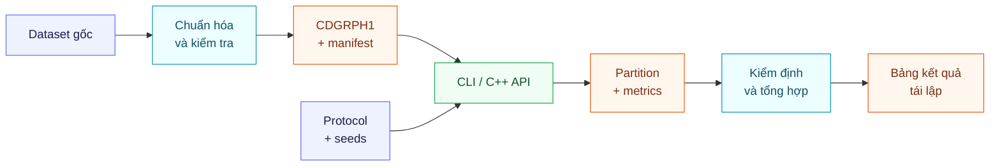

<div align="center">

<p><a href="README.md">English</a> · <strong>Tiếng Việt</strong></p>

# Community Detection Benchmark

<p><strong>Pipeline C++17/Python cho thực nghiệm phát hiện cộng đồng có thể kiểm chứng và tái lập</strong></p>

Triển khai, chạy và đánh giá **Girvan–Newman**, **Spectral Clustering**,
**Louvain** và **Label Propagation** trên cùng một giao thức thống nhất.

<p>
  <a href="https://github.com/DongQuanz/community-detection-cpp/actions/workflows/ci.yml"></a>
  <a href="https://isocpp.org/"></a>
  <a href="https://www.python.org/"></a>
  <a href="https://cmake.org/"></a>
</p>

<p>
  <a href="LICENSE"></a>
  
  
</p>

[Tổng quan](#tổng-quan) · [Thuật toán](#thuật-toán) · [Bắt đầu nhanh](#bắt-đầu-nhanh) · [Thực nghiệm](#chạy-thực-nghiệm) · [Metrics](#hệ-metric) · [Cấu trúc](#cấu-trúc-repository) · [Trích dẫn](#trích-dẫn)

</div>

---

## Tổng quan

**Community Detection Benchmark** là pipeline nghiên cứu kết hợp lõi C++17 hiệu
năng cao với công cụ điều phối Python. Dự án đặt bốn thuật toán phát hiện cộng
đồng vào cùng một định dạng dữ liệu, API, CLI và giao thức đánh giá để kết quả có
thể được đối chiếu công bằng và tái lập.

| | Tổng quan nhanh |
|---|---|
| **Phương pháp** | Girvan–Newman · Spectral RatioCut/Ncut · Louvain · LPA |
| **Đầu vào chuẩn** | Đồ thị đơn, vô hướng, không trọng số sau tiền xử lý |
| **Lõi tính toán** | C++17, lưu trữ CSR, không cần dependency C++ bên thứ ba |
| **Điều phối** | Python cho chuẩn hóa dataset, lập job, provenance và tổng hợp |
| **Đánh giá** | Chất lượng nội tại, nhãn ngoài, stability, robustness và tài nguyên |
| **Dataset mục tiêu** | Karate · Football · ca-CondMat · GraphSAINT/Reddit2 |

### Điểm nổi bật

- **Một giao diện thống nhất** cho cả bốn thuật toán qua thư viện C++ và CLI.
- **Tái lập từ đầu đến cuối** bằng seed, checksum, config, manifest và hash binary.
- **Không che giấu thất bại:** job không khả thi luôn có trạng thái và lý do cụ thể.
- **Đánh giá đa chiều:** chất lượng phân hoạch đi cùng độ ổn định, độ bền và chi phí.
- **Tách biệt scope:** full graph, mẫu 400 đỉnh và mẫu 5.000 đỉnh không bị gộp chung.
- **An toàn dữ liệu:** dataset, output thực nghiệm, cache và secret không nằm trong Git.

### Kiến trúc pipeline



> [!IMPORTANT]
> Mọi thuật toán trả về phân hoạch không chồng lấn; nhãn cộng đồng luôn được
> chuẩn hóa về `0..K-1`.

## Thuật toán

| Phương pháp | Hiện thực | Quy mô phù hợp |
|---|---|---|
| **Girvan–Newman** | Brandes không trọng số; mỗi vòng xóa đúng một cạnh cực đại rồi tính lại betweenness | Đồ thị nhỏ và mẫu đã đăng ký |
| **Spectral** | RatioCut/Ncut; Jacobi đặc và Lanczos matrix-free; luôn kiểm tra residual | Đồ thị nhỏ đến vừa, tùy resource guard |
| **Louvain** | Tối ưu modularity đa tầng với cùng một `resolution` ở mọi tầng | Đồ thị lớn |
| **Label Propagation** | Cập nhật đồng bộ hoặc bất đồng bộ theo seed; giữ nguyên isolate | Đồ thị lớn |

<details>
<summary><strong>Các đảm bảo triển khai quan trọng</strong></summary>

- Girvan–Newman tính lại Brandes sau **mỗi** cạnh bị xóa.
- Spectral Ncut với `K=2` dùng đúng tọa độ `g = D^{-1/2}z`.
- Backend spectral lớn không dựng ma trận `n × n` và từ chối eigenpair thiếu chính xác.
- Louvain dùng nhất quán cùng một `resolution` trong local move, aggregation và metric.
- Mọi quyết định ngẫu nhiên của LPA chỉ phụ thuộc vào seed cấu hình.

</details>

## Yêu cầu

| Thành phần | Phiên bản |
|---|---:|
| C++ compiler | Hỗ trợ C++17 |
| CMake | 3.18 trở lên |
| Python | 3.10 trở lên |
| Python packages | Xem [`requirements.txt`](requirements.txt) |

## Bắt đầu nhanh

### 1. Build và chạy test

```bash
cmake -S . -B build -DCMAKE_BUILD_TYPE=Release
cmake --build build --config Release --parallel
ctest --test-dir build -C Release --output-on-failure
```

> [!NOTE]
> Với generator một cấu hình trên Linux/macOS, `-C Release` được bỏ qua. Visual
> Studio thường đặt executable trong `build/Release/`.

### 2. Chuẩn bị môi trường Python

<details open>
<summary><strong>Linux / macOS</strong></summary>

```bash
python3 -m venv .venv
source .venv/bin/activate
python -m pip install --upgrade pip
python -m pip install -r requirements.txt
```

</details>

<details>
<summary><strong>Windows PowerShell</strong></summary>

```powershell
python -m venv .venv
.venv\Scripts\Activate.ps1
python -m pip install --upgrade pip
python -m pip install -r requirements.txt
```

</details>

### 3. Chạy ví dụ tối thiểu

```bash
./build/run_toy_example
```

Trên Visual Studio multi-config, dùng `build/Release/run_toy_example.exe`.

```cpp
#include <community_detection/community_detection.hpp>

cd::Graph graph(3);
graph.add_edge(0, 1);
graph.add_edge(1, 2);

cd::louvain::Config config;
config.seed = 42;

const auto result = cd::experiment::run(graph, config);
```

## Chạy thực nghiệm

### Bước 1 — Chuẩn hóa dataset

Tải dữ liệu theo hướng dẫn tại [`data/README.md`](data/README.md), sau đó chạy:

```bash
python tools/prepare_datasets.py \
  --config configs/datasets.example.json
```

Công cụ chuẩn hóa loại self-loop và cạnh trùng, ánh xạ node về `0..n-1`, tạo
các mẫu cảm sinh đã đăng ký và ghi SHA-256 vào
`data/processed/manifest.json`.

### Bước 2 — Xem trước ma trận job

```bash
python tools/run_experiments.py \
  --config configs/experiments.json \
  --binary build/community_detect \
  --dry-run
```

Trên Visual Studio multi-config, thay đường dẫn binary bằng
`build/Release/community_detect.exe`.

### Bước 3 — Chạy hoặc tiếp tục an toàn

```bash
python tools/run_experiments.py \
  --config configs/experiments.json \
  --binary build/community_detect \
  --resume
```

### Bước 4 — Kiểm định và tổng hợp

```bash
python tools/summarize_results.py \
  --results results \
  --manifest data/processed/manifest.json
```

> [!CAUTION]
> Các job mặc định chạy tuần tự để số đo runtime và peak memory không bị nhiễu
> bởi tranh chấp tài nguyên. Không ghi job bị skip thành `0`: runner dùng trạng
> thái `skipped_resource_guard` cùng lý do cụ thể.

### Chạy một thuật toán

```bash
build/community_detect \
  --graph data/processed/karate/full.cdgraph \
  --reference data/processed/karate/reference.tsv \
  --dataset karate \
  --algorithm louvain \
  --seed 42 \
  --resolution 1.0 \
  --output-dir results/manual/karate_louvain_seed42
```

Chạy `community_detect --help` để xem đầy đủ tùy chọn. Mỗi run xuất partition đã
chuẩn hóa, metric theo cộng đồng, summary máy đọc được, chẩn đoán hội tụ và thời
gian thực thi.

### Artifact đầu ra

| Artifact | Vai trò |
|---|---|
| `manifest.json` | Mô tả dataset, preprocessing và checksum |
| `provenance.json` | Liên kết kết quả với binary, config, manifest và môi trường |
| `run_index.jsonl` | Lệnh chạy, trạng thái, thời gian và lý do lỗi/skip |
| `summary.json` | Metric và chẩn đoán của một run |
| `partition.tsv` | Nhãn cộng đồng chuẩn hóa theo node |
| `results/tables/` | Bảng tổng hợp dùng cho báo cáo |

JSON dùng `null` cho metric không xác định; CSV dùng ô trống hoặc `NA`.

## Hệ metric

| Nhóm đánh giá | Metric chính | Mục đích |
|---|---|---|
| **Nội tại** | Coverage, `Q_gamma`, RatioCut, Ncut, density, conductance | Đánh giá cấu trúc phân hoạch |
| **Nhãn ngoài** | Pairwise precision/recall/F1, ARI, AMI | So với metadata tham chiếu khi có |
| **Độ tin cậy** | Stability giữa seed, robustness khi bỏ 1% và 5% cạnh | Đo độ nhạy của kết quả |
| **Tài nguyên** | Algorithm time, metric time, wall time, peak RSS | Đánh giá chi phí vận hành |

> [!NOTE]
> Không nên xếp hạng bốn thuật toán bằng một objective duy nhất. Louvain trực
> tiếp tối ưu modularity, còn spectral clustering tối ưu một dạng cut; kết luận
> cần đi kèm `K`, scope, stability, robustness và chi phí tài nguyên.

Nhãn lớp Reddit2 là metadata ngoài, không phải ground truth cấu trúc.
ca-CondMat không có nhãn ngoài nên các metric tương ứng để trống.

## Dùng như thư viện C++

Cài package vào prefix mong muốn:

```bash
cmake --install build --config Release --prefix /your/install/prefix
```

Sau đó liên kết target CMake:

```cmake
find_package(community_detection CONFIG REQUIRED)

target_link_libraries(your_target
  PRIVATE community_detection::community_detection
)
```

## Cấu trúc repository

```text
community-detection-cpp/
├── apps/                         # CLI cho một run
├── cmake/                        # Cấu hình CMake package
├── configs/                      # Protocol và mẫu cấu hình dataset
├── data/
│   └── README.md                 # Hướng dẫn dữ liệu cục bộ
├── examples/                     # Ví dụ dùng thư viện C++
├── include/community_detection/  # Public C++ API
├── src/                          # Hiện thực C++
├── tests/                        # Unit test và smoke test end-to-end
├── tools/                        # Chuẩn hóa, điều phối và tổng hợp
├── CITATION.cff                  # Metadata trích dẫn
├── README.md                     # English documentation
├── README.vi.md                  # Tài liệu tiếng Việt
└── LICENSE                       # PolyForm Noncommercial 1.0.0
```

Dataset gốc, dữ liệu đã xử lý, kết quả, binary, cache, log, secret và cấu hình
chứa đường dẫn máy cá nhân đều bị loại khỏi Git. Artifact kết quả nếu công bố
cần đi kèm manifest, provenance, run index, config và hash binary tương ứng.

## Đóng góp

Đọc [`CONTRIBUTING.md`](CONTRIBUTING.md) trước khi thay đổi thuật toán, metric
hoặc schema. Quality gate tối thiểu:

```bash
cmake -S . -B build -DCMAKE_BUILD_TYPE=Release
cmake --build build --config Release --parallel
ctest --test-dir build -C Release --output-on-failure
python -m py_compile tools/*.py tests/test_pipeline.py
```

## Trích dẫn

Nếu dự án hỗ trợ nghiên cứu của bạn, vui lòng trích dẫn bằng metadata trong
[`CITATION.cff`](CITATION.cff). GitHub cũng có thể xuất BibTeX trực tiếp từ mục
**Cite this repository**.

```text
Dong-Quan Ngo-Nguyen. Community Detection Benchmark: a reproducible C++17/Python
pipeline for community-detection research. Version 1.0.0, 2026.
https://github.com/DongQuanz/community-detection-cpp
```

## Giấy phép

Dự án được phân phối theo
**[PolyForm Noncommercial License 1.0.0](LICENSE)**
(`PolyForm-Noncommercial-1.0.0`). Giấy phép cho phép sử dụng, sửa đổi và phân
phối phần mềm cho các mục đích phi thương mại được định nghĩa trong toàn văn;
mọi bản sao phải kèm điều khoản license và dòng `Required Notice` của dự án.

> [!WARNING]
> Đây là giấy phép source-available có giới hạn sử dụng, không phải giấy phép mã
> nguồn mở được OSI phê duyệt.

---

<div align="center">

<sub>Được xây dựng cho những thực nghiệm phát hiện cộng đồng có thể kiểm chứng, tái lập và mở rộng.</sub>

</div>
